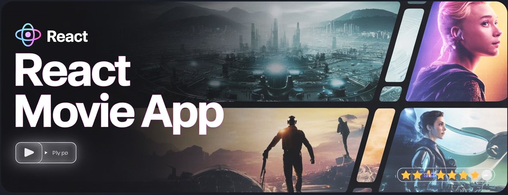

# 🎬 Movie App

## 📚 Table of Contents
- [🎬 Introduction](#-introduction)
- [⚙️ Tech Stack](#️-tech-stack)
- [🔋 Features](#-features)
- [🤸 Quick Start](#-quick-start)
- [📁 Folder Structure](#-folder-structure-for-reference-optional)
- [🙌 Credits](#-credits)
- [🪪 License](#-license)

---

## 🎬 Introduction

A sleek and modern movie browsing app built with **React.js**, **Tailwind CSS**, **Vite**, and powered by **Appwrite** and **The Movie Database (TMDB) API**. Users can browse trending movies, search for titles, and explore rich movie content — all in a responsive and elegant UI.

---

## ⚙️ Tech Stack

- **[React.js](https://reactjs.org/)** – For building the user interface
- **[Appwrite](https://appwrite.io/)** – Backend-as-a-Service for managing auth, DB, and APIs
- **[Tailwind CSS](https://tailwindcss.com/)** – Utility-first CSS for responsive design
- **[Vite](https://vitejs.dev/)** – Next-gen frontend tooling for fast builds
- **[React Use](https://github.com/streamich/react-use)** – Essential React hooks

---

## 🔋 Features

- 🔍 **Search Movies** – Find movies by title using TMDB’s powerful search API  
- 🔥 **Trending Movies** – View dynamically updated trending titles  
- 🖥️ **Modern UI/UX** – Clean and responsive layout  
- 📱 **Mobile-Friendly** – Works seamlessly across all devices  
- ♻️ **Reusable Components** – Modular and maintainable code architecture  
- ⚙️ **Environment Variables** – Secure API management via .env.local

---

## 🤸 Quick Start

### 📦 Prerequisites

Ensure you have the following installed:

- [Git](https://git-scm.com/)
- [Node.js & npm](https://nodejs.org/)

### Step 1: 🔗 Clone the Repository

```bash
git clone https://github.com/Sahil-Goes/movie-app-using-react.git
cd movie-app-using-react
```

### Step 2: 🧩 Install Dependencies
```bash
npm install
```

### Step 3: 🛡️ Set Up Environment Variables
Create a .env.local file in the root directory and add your credentials:
```bash
VITE_TMDB_API_KEY=your_tmdb_api_key
VITE_APPWRITE_PROJECT_ID=your_project_id
VITE_APPWRITE_DATABASE_ID=your_database_id
VITE_APPWRITE_COLLECTION_ID=your_collection_id
```

### Step 4: 🚀 Start the Development Server
```bash
npm run dev
```

### 📁 Folder Structure for Reference (Optional)
```lua
movie-app/
│
├── public/
├── src/
│   ├── components/
│   ├── pages/
│   ├── App.jsx
│   ├── main.jsx
│
├── .env.local
├── package.json
└── vite.config.js
```


## 🙌 Credits
- Project based on JSMastery's tutorial on YouTube.
- Backend powered by Appwrite and data from TMDB.


## 🪪 License
This project is licensed under the [MIT License](https://choosealicense.com/licenses/mit/).

______
